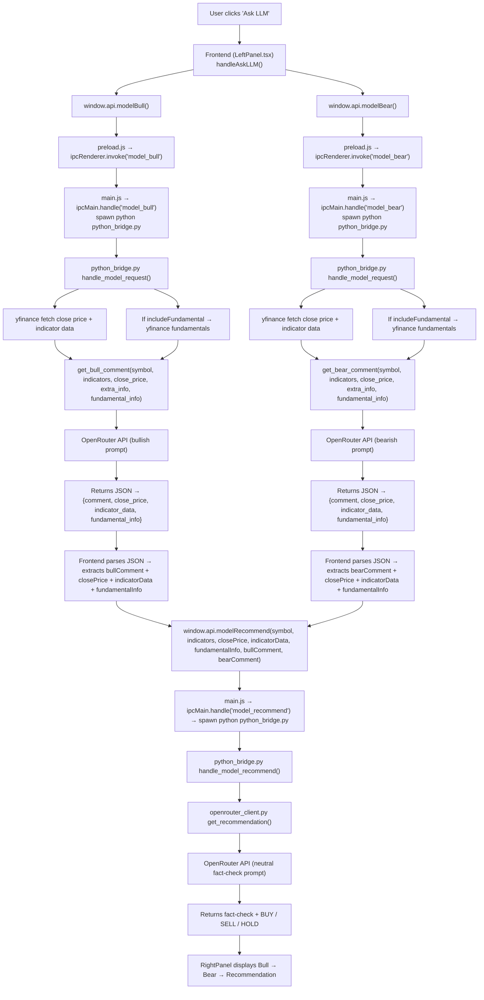

# TradingYourModel — Design Document

**VS Code Note:** This file uses Mermaid diagrams. Install the **Markdown Preview Mermaid Support** extension (bierner.markdown-mermaid) in VS Code to render them. Alternatively, open this file in GitHub or any Mermaid-compatible viewer.

## "Ask LLM" Button Flowchart

The diagram below illustrates the end-to-end data flow when the user clicks the **Ask LLM** button in the Model tab.

## Sequence Summary

1. **User clicks "Ask LLM"** — triggers `handleAskLLM()` in `LeftPanel.tsx`.
2. **Parallel bull/bear calls** — `modelBull()` and `modelBear()` are invoked simultaneously via the Electron IPC bridge.
3. **Python bridge data gathering** — each call fetches the latest close price, technical indicator data from `yfinance`, and optionally fundamental data.
4. **LLM analysis** — `get_bull_comment()` and `get_bear_comment()` send requests to the OpenRouter API with bullish/bearish system prompts.
5. **JSON-encoded response** — the Python bridge now returns `{comment, close_price, indicator_data, fundamental_info}` so the frontend has all auxiliary data without re-fetching.
6. **Recommendation step** — the frontend calls `modelRecommend()` with the symbol, indicators, close price, indicator data, fundamentals, and both bull/bear comments.
7. **Fact-check and final verdict** — `get_recommendation()` sends a neutral prompt to OpenRouter asking it to fact-check the bull/bear claims against the actual data and produce a **BUY / SELL / HOLD** recommendation.
8. **Display** — the right panel shows the bull comment, bear comment, and recommendation (with fact-check details) in order.

## Architecture Layers

| Layer          | Technology              | Files                                               |
| -------------- | ----------------------- | --------------------------------------------------- |
| UI (React)     | TypeScript, MUI         | `LeftPanel.tsx`, `RightPanel.tsx`, `App.tsx`        |
| IPC Bridge     | Electron preload        | `preload.js`                                        |
| Main Process   | Electron (Node.js)      | `main.js`                                           |
| Python Backend | Python 3                | `python_bridge.py`                                  |
| Data Fetching  | yfinance                | `tradingyourmodel/dataflows/y_finance.py`           |
| LLM Client     | urllib → OpenRouter API | `tradingyourmodel/llm/clients/openrouter_client.py` |
