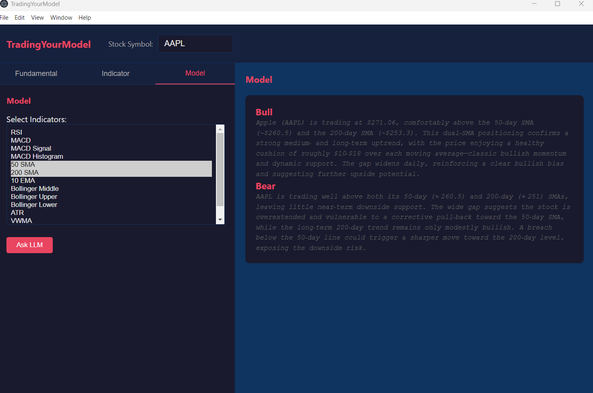

# TradingYourModel

An application that allows users to analyze stocks by selecting technical indicators and receiving AI-powered Bull and Bear market commentary, as well as access to stock fundamentals and indicators.

## Features

### 1. AI-Powered Market Analysis

- **Custom Indicator Selection**: Users can pick any technical indicators they prefer for their analysis.
- **Bull/Bear Comments**: The application uses a Large Language Model (LLM) to generate Bull (positive) and Bear (negative) market commentary based on the selected indicators.
- **Context-Aware Analysis**: The LLM considers the latest stock price and indicator data to provide relevant insights.

### 2. Stock Data Access

- **Fundamentals**: Users can check comprehensive stock fundamentals including financial metrics, company information, and key ratios.
- **Technical Indicators**: Access to various technical indicators with customizable time windows for detailed technical analysis.

### 3. User Interface

The application provides an intuitive interface for selecting indicators, viewing analysis results, and accessing stock data.

## How It Works

1. **Select Indicators**: Choose from a variety of technical indicators that you want to analyze.
2. **Request Analysis**: Submit your request for either Bull or Bear market commentary.
3. **AI Processing**: The system gathers the latest stock data and your selected indicators, then processes this information through an LLM.
4. **Receive Insights**: Get back AI-generated commentary focused on your selected indicators without the raw indicator data cluttering the response.
5. **Check Fundamentals**: Optionally, access detailed stock fundamentals and technical indicators for a comprehensive view.

## Technical Architecture

The application consists of:

- **Backend**: Python-based HTTP server that handles data fetching from Yahoo Finance and processes requests through an LLM API.
- **Frontend**: Electron-based application providing a user interface for interacting with the analysis features.
- **Data Sources**: Integration with Yahoo Finance for real-time stock data and technical indicators.
- **AI Integration**: Uses OpenRouter API to access LLM capabilities for generating market commentary.

## API Endpoints

- `/model/bull`: Get Bull market commentary for selected indicators
- `/model/bear`: Get Bear market commentary for selected indicators
- `/fundamentals/{symbol}`: Retrieve stock fundamentals for a given symbol
- `/indicator/{symbol}/{indicator}`: Get specific indicator data for a stock

## Getting Started

1. Install dependencies for both the Python backend and Electron frontend.
2. Configure your environment variables, including API keys for the LLM service.
3. Run the server and launch the Electron application.
4. Select a stock symbol, choose your indicators, and request Bull or Bear analysis.

## Future Enhancements

- Additional technical indicators
- More LLM model options
- Historical analysis capabilities
- Portfolio tracking features
- Custom alert systems based on indicator combinations
