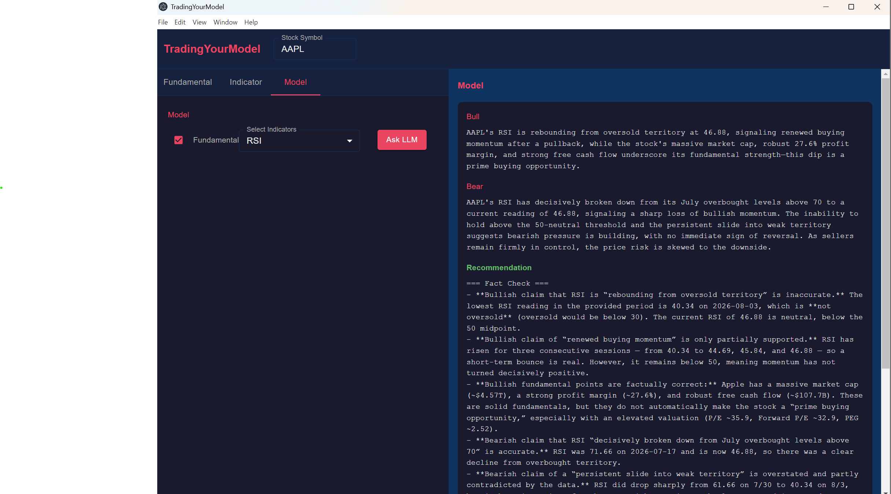

# TradingYourModel

A desktop application that analyzes stocks with LLM assistance: pick technical indicators, get Bull and Bear commentary from an LLM, then a neutral fact-check pass that produces a **BUY / SELL / HOLD** recommendation. Stock fundamentals and raw indicator data are also viewable on their own.

> **Disclaimer:** This is an educational/experimental tool. Output is LLM-generated and is not investment advice.

## Features

### 1. AI-Powered Market Analysis

- **Custom Indicator Selection**: Pick one or more of 13 technical indicators for the analysis.
- **Bull/Bear Comments**: The app queries an LLM twice in parallel — once with a bullish system prompt, once with a bearish one — to generate opposing commentary on the same data.
- **Fact-Check + Recommendation**: A third LLM call reviews both comments against the actual indicator/fundamental data, flags unsupported claims, and returns a BUY / SELL / HOLD verdict.
- **Context-Aware Analysis**: Every LLM call receives the latest close price and a 30-day window of data for each selected indicator.
- **Optional Fundamentals**: A checkbox in the Model tab adds company fundamentals to the LLM context.

### 2. Stock Data Access

- **Fundamentals**: Company profile plus ~28 metrics from Yahoo Finance — market cap, trailing/forward PE, PEG, price-to-book, EPS, dividend yield, beta, 52-week high/low, revenue, EBITDA, margins, ROE/ROA, debt-to-equity, current ratio, book value, free cash flow, and more.
- **Technical Indicators**: Any single indicator over a 30-day lookback window, rendered as text with a short usage description of the indicator.

### 3. User Interface



Three tabs on the left (**Fundamental**, **Indicator**, **Model**) drive the output panel on the right. The stock symbol is entered once in the top bar and shared by all tabs.

## Supported Indicators

| Value           | Label            |
| --------------- | ---------------- |
| `rsi`           | RSI              |
| `macd`          | MACD             |
| `macds`         | MACD Signal      |
| `macdh`         | MACD Histogram   |
| `close_50_sma`  | 50 SMA           |
| `close_200_sma` | 200 SMA          |
| `close_10_ema`  | 10 EMA           |
| `boll`          | Bollinger Middle |
| `boll_ub`       | Bollinger Upper  |
| `boll_lb`       | Bollinger Lower  |
| `atr`           | ATR              |
| `vwma`          | VWMA             |
| `mfi`           | MFI              |

## How It Works

1. **Enter a Symbol**: Type a ticker in the top bar (defaults to `AAPL`).
2. **Select Indicators**: In the Model tab, choose one or more indicators; optionally tick **Fundamental**.
3. **Ask LLM**: The app fetches the latest close price and a 30-day window for each selected indicator from Yahoo Finance.
4. **Bull & Bear**: Both comments are requested in parallel through OpenRouter.
5. **Recommendation**: The bull comment, bear comment, and all underlying data are sent back to the LLM for a neutral fact-check and a BUY / SELL / HOLD call.
6. **Display**: The right panel shows Bull → Bear → Recommendation in order.

See [Design.md](Design.md) for the full end-to-end flowchart of the "Ask LLM" path.

## Technical Architecture

| Layer          | Technology                        | Files                                               |
| -------------- | --------------------------------- | --------------------------------------------------- |
| UI             | React 18, TypeScript, MUI 6, Vite | `electron_app/frontend/src/`                        |
| IPC Bridge     | Electron `contextBridge`          | `electron_app/preload.js`                           |
| Main Process   | Electron 33 (Node.js)             | `electron_app/main.js`                              |
| Python Backend | Python ≥ 3.10                     | `electron_app/python_bridge.py`                     |
| Data Fetching  | yfinance, stockstats              | `tradingyourmodel/dataflows/y_finance.py`           |
| LLM Client     | `urllib` → OpenRouter API         | `tradingyourmodel/llm/clients/openrouter_client.py` |

The renderer never talks to a network server. It calls `window.api.*`, which goes over Electron IPC to the main process, which spawns `python_bridge.py` as a short-lived subprocess per request and parses its JSON stdout.

Data comes from Yahoo Finance via `yfinance` — quotes are delayed, not real-time.

### Optional standalone HTTP server

`electron_app/server.py` is a separate, self-contained HTTP server (default port `8765`) exposing the same dataflows for scripting or debugging. **The Electron app does not use it**, and it predates the fundamentals toggle and the recommendation step.

- `GET  /fundamentals/{symbol}` — stock fundamentals
- `GET  /indicator/{symbol}/{indicator}` — 30-day indicator window
- `POST /model/bull` — body `{"symbol": "AAPL", "indicators": ["rsi"]}` → bull comment
- `POST /model/bear` — same body → bear comment

Run with `python electron_app/server.py --port 8765`.

## Getting Started

### Prerequisites

- Python ≥ 3.10
- Node.js (for Electron and Vite)
- An [OpenRouter](https://openrouter.ai/) API key

### Setup

1. **Create and activate a virtual environment** (from the repo root):

   ```powershell
   # Windows (PowerShell)
   python -m venv .venv
   .\.venv\Scripts\Activate.ps1
   ```

   ```bash
   # macOS / Linux
   python3 -m venv .venv
   source .venv/bin/activate
   ```

2. **Install the Python package and dependencies** (with the venv active):

   ```bash
   pip install -e .
   ```

3. **Install Node dependencies**:

   ```bash
   cd electron_app && npm install
   cd frontend && npm install
   ```

4. **Create a `.env` file in the repo root**:

   ```bash
   OPENROUTER_API_KEY=your_key_here
   OPENROUTER_MODEL=openai/gpt-3.5-turbo   # optional; this is the default
   ```

5. **Run the app** (builds the frontend, then launches Electron):

   ```bash
   cd electron_app
   npm start          # or: npm run dev   (opens DevTools)
   ```

The virtual environment must be **active** in the terminal where you run `npm start` — the Electron main process spawns `python` directly, so `python` must resolve to the venv (where the dependencies are installed).

## Future Enhancements

- Additional technical indicators
- Configurable lookback window (currently fixed at 30 days)
- Long-running Python process instead of per-request subprocess spawn
- More LLM model options and in-app model selection
- Historical analysis capabilities
- Portfolio tracking features
- Custom alert systems based on indicator combinations

## Credits & License

The `tradingyourmodel/dataflows` and config modules derive from [TauricResearch/TradingAgents](https://github.com/TauricResearch/TradingAgents), with modifications.

Licensed under the Apache License 2.0 — see [LICENSE](LICENSE).
